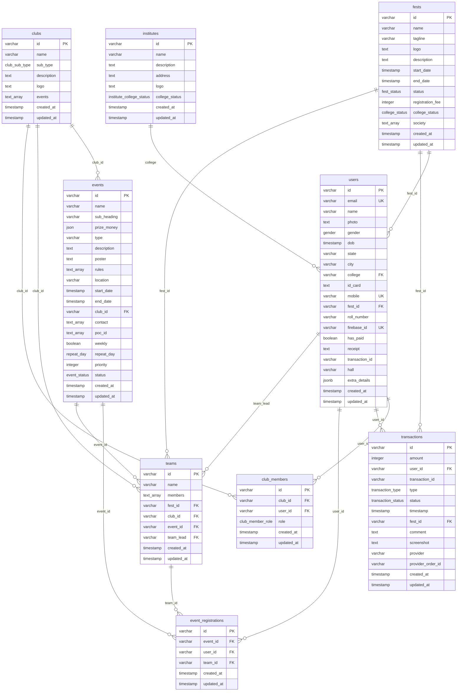

# Database schema

PostgreSQL schema for Project Xangoes.

- **ORM:** Drizzle in `src/db/schema/`
- **Client:** `src/db/schema.ts` (`pg` Pool)
- **Baseline migration:** `drizzle/0000_pink_blackheart.sql`
- **Journal:** a single `0000` entry. Anyone who applied the old `0000`–`0002` files must recreate an empty local database before `bun run db:migrate`. Do not migrate a shared or production database that still has the old journal.

PKs are application-generated `varchar(255)` strings (not serial/uuid columns). Timestamps are PostgreSQL `timestamp` (no time zone) with `now()` defaults on `created_at` / `updated_at`. `ON UPDATE` for all FKs is `NO ACTION`.

Source of truth: this document matches the generated baseline. `src/db/schema/admin.ts` is **not** migrated (see [Out of scope](#out-of-scope)).

## Entity relationship diagram



`club_members` is club **staff / org membership**. `teams` is an **event participation team** (lead + member id array). Do not treat them as the same thing.

`clubs.events` is a leftover denormalized `text[]`. Canonical club–event links are `events.club_id`.

---

## Enums

| PostgreSQL type | Values |
| --- | --- |
| `gender` | `MALE`, `FEMALE`, `OTHERS` |
| `fest_status` | `ACTIVE`, `DRAFT`, `EXPIRED` |
| `event_status` | `ACTIVE`, `DRAFT`, `EXPIRED` |
| `college_status` | `BLACKLISTED`, `ALLOWED`, `OTHER` |
| `institute_college_status` | `BLACKLISTED`, `ALLOWED`, `OTHER` |
| `club_sub_type` | `TECHNICAL`, `CULTURAL`, `SPORTS`, `HACKATHON`, `LITERARY`, `FMS` |
| `repeat_day` | `MONDAY`, `TUESDAY`, `WEDNESDAY`, `THURSDAY`, `FRIDAY`, `SATURDAY`, `SUNDAY` |
| `transaction_type` | `REGISTRATION`, `MERCH`, `EVENT` |
| `transaction_status` | `PENDING`, `VERIFIED`, `REJECTED` |
| `club_member_role` | `MEMBER`, `CORE`, `COORDINATOR`, `LEAD` |

`college_status` (fests) and `institute_college_status` (institutes) are separate types with the same labels.

---

## Tables

Column tables use:

- **TS** — Drizzle property name
- **SQL** — PostgreSQL column name
- **Null** — whether the column allows `NULL`
- **Default** — SQL default, or `—` if none

### `institutes`

Educational institutions. Source: `src/db/schema/institute.ts`.

| TS | SQL | Type | Null | Default | Keys | Description |
| --- | --- | --- | --- | --- | --- | --- |
| `id` | `id` | `varchar(255)` | no | — | PK | Institute id |
| `name` | `name` | `varchar(255)` | no | — | | Display name |
| `description` | `description` | `text` | no | — | | Description |
| `address` | `address` | `text` | no | — | | Address |
| `logo` | `logo` | `text` | yes | — | | Logo URL |
| `collegeStatus` | `college_status` | `institute_college_status` | yes | — | | Allow / blacklist status |
| `createdAt` | `created_at` | `timestamp` | no | `now()` | | Created |
| `updatedAt` | `updated_at` | `timestamp` | no | `now()` | | Updated |

No extra indexes or FKs. Relations: one institute has many `users` (`users.college`).

---

### `fests`

Top-level festival. Source: `src/db/schema/fest.ts`.

| TS | SQL | Type | Null | Default | Keys | Description |
| --- | --- | --- | --- | --- | --- | --- |
| `id` | `id` | `varchar(255)` | no | — | PK | Fest id |
| `name` | `name` | `varchar(255)` | no | — | | Display name |
| `tagline` | `tagline` | `varchar(500)` | yes | — | | Tagline |
| `logo` | `logo` | `text` | yes | — | | Logo URL |
| `description` | `description` | `text` | yes | — | | Description |
| `startDate` | `start_date` | `timestamp` | no | — | | Start |
| `endDate` | `end_date` | `timestamp` | no | — | | End |
| `status` | `status` | `fest_status` | yes | `'ACTIVE'` | | Lifecycle |
| `registrationFee` | `registration_fee` | `integer` | yes | — | | Registration fee (smallest currency unit as stored) |
| `collegeStatus` | `college_status` | `college_status` | yes | `'ALLOWED'` | | College participation policy |
| `society` | `society` | `text[]` | yes | — | | Society names |
| `createdAt` | `created_at` | `timestamp` | no | `now()` | | Created |
| `updatedAt` | `updated_at` | `timestamp` | no | `now()` | | Updated |

No extra indexes. Relations: many `users`, `teams`, `transactions`.

---

### `clubs`

Organizing bodies. Source: `src/db/schema/club.ts`.

| TS | SQL | Type | Null | Default | Keys | Description |
| --- | --- | --- | --- | --- | --- | --- |
| `id` | `id` | `varchar(255)` | no | — | PK | Club id |
| `name` | `name` | `varchar(255)` | no | — | | Display name |
| `subType` | `sub_type` | `club_sub_type` | no | — | | Club category |
| `description` | `description` | `text` | yes | — | | Description |
| `logo` | `logo` | `text` | yes | — | | Logo URL |
| `events` | `events` | `text[]` | yes | — | | Denormalized leftover; **not** the FK. Use `events.club_id` |
| `createdAt` | `created_at` | `timestamp` | no | `now()` | | Created |
| `updatedAt` | `updated_at` | `timestamp` | no | `now()` | | Updated |

No extra indexes. Relations: many `events`, `teams`, `club_members`.

---

### `users`

Participants. Core identity is columns; overflow is `extra_details`. Source: `src/db/schema/user.ts`.

| TS | SQL | Type | Null | Default | Keys | Description |
| --- | --- | --- | --- | --- | --- | --- |
| `id` | `id` | `varchar(255)` | no | — | PK | User id |
| `email` | `email` | `varchar(255)` | no | — | UNIQUE `users_email_unique` | Email |
| `name` | `name` | `varchar(255)` | yes | — | | Display name |
| `photo` | `photo` | `text` | yes | — | | Profile photo URL |
| `gender` | `gender` | `gender` | yes | — | | Gender |
| `dob` | `dob` | `timestamp` | yes | — | | Date of birth |
| `state` | `state` | `varchar(100)` | yes | — | | State (store lowercase) |
| `city` | `city` | `varchar(100)` | yes | — | | City (store lowercase) |
| `college` | `college` | `varchar(255)` | yes | — | FK → `institutes.id` | Home institute |
| `idCard` | `id_card` | `text` | yes | — | | ID-card image URL (Cloudinary) |
| `mobile` | `mobile` | `varchar(20)` | no | — | UNIQUE `users_mobile_unique` | Phone |
| `festID` | `fest_id` | `varchar(255)` | yes | — | FK → `fests.id` | Associated fest |
| `rollNumber` | `roll_number` | `varchar(50)` | yes | — | | College roll number |
| `firebaseId` | `firebase_id` | `varchar(255)` | no | — | UNIQUE `users_firebase_id_unique` | Firebase Auth uid |
| `hasPaid` | `has_paid` | `boolean` | yes | `false` | | Fest payment flag |
| `receipt` | `receipt` | `text` | yes | — | | Receipt URL / text |
| `transactionID` | `transaction_id` | `varchar(255)` | yes | — | indexed, **not** an FK | Stored payment reference string (not `transactions.id`) |
| `hall` | `hall` | `varchar(100)` | yes | — | | Allotted hall of residence |
| `extraDetails` | `extra_details` | `jsonb` | yes | — | | Overflow JSON; see [Zod contract](#users-extra_details-zod) |
| `createdAt` | `created_at` | `timestamp` | no | `now()` | | Created |
| `updatedAt` | `updated_at` | `timestamp` | no | `now()` | | Updated |

**Foreign keys**

| Name | Column | References | ON DELETE |
| --- | --- | --- | --- |
| `users_college_institutes_id_fk` | `college` | `institutes.id` | `SET NULL` |
| `users_fest_id_fests_id_fk` | `fest_id` | `fests.id` | `SET NULL` |

**Indexes:** `users_college_idx` (`college`), `users_fest_id_idx` (`fest_id`), `users_transaction_id_idx` (`transaction_id`).

**Relations:** `institute`, `fest`, many `transactions`, `event_registrations`, `ledTeams` (as `teams.team_lead`), `clubMemberships`.

#### `users.extra_details` (Zod)

Validated by `extraDetailsSchema` in `src/db/schema/userExtraDetails.ts`. `.strict()`: unknown keys fail. PostgreSQL does not enforce this shape; validate on write with `parseExtraDetails()`.

| Key | Type | Required | Rules |
| --- | --- | --- | --- |
| `stream` | `string` | no | max 255 |
| `referredBy` | `string` | no | max 255 |
| `ca` | `string[]` | no | campus ambassador ids / codes |

Example:

```json
{ "stream": "CSE", "referredBy": "seed_ca", "ca": ["ca_01"] }
```

---

### `events`

Competitions and activities. Source: `src/db/schema/event.ts`. TS property is `clubId`; SQL column is `club_id`.

| TS | SQL | Type | Null | Default | Keys | Description |
| --- | --- | --- | --- | --- | --- | --- |
| `id` | `id` | `varchar(255)` | no | — | PK | Event id |
| `name` | `name` | `varchar(255)` | no | — | | Name |
| `subHeading` | `sub_heading` | `varchar(500)` | yes | — | | Subtitle |
| `prizeMoney` | `prize_money` | `json` | yes | — | | Prize structure object |
| `type` | `type` | `varchar(100)` | yes | — | | Event type label |
| `description` | `description` | `text` | no | — | | Description |
| `poster` | `poster` | `text` | no | — | | Poster URL |
| `rules` | `rules` | `text[]` | no | — | | Rule strings |
| `location` | `location` | `varchar(255)` | yes | — | | Venue |
| `startDate` | `start_date` | `timestamp` | no | — | | Start |
| `endDate` | `end_date` | `timestamp` | yes | — | | End |
| `clubId` | `club_id` | `varchar(255)` | yes | — | FK → `clubs.id` | Organizing club |
| `contact` | `contact` | `text[]` | no | — | | Contact phone numbers |
| `pocID` | `poc_id` | `text[]` | no | — | | Point-of-contact user ids (**no FK**; array) |
| `weekly` | `weekly` | `boolean` | yes | `false` | | Repeats weekly |
| `repeatDay` | `repeat_day` | `repeat_day` | yes | — | | Weekday when `weekly` |
| `priority` | `priority` | `integer` | yes | `1` | | Display / sort priority |
| `status` | `status` | `event_status` | yes | `'DRAFT'` | | Lifecycle |
| `createdAt` | `created_at` | `timestamp` | no | `now()` | | Created |
| `updatedAt` | `updated_at` | `timestamp` | no | `now()` | | Updated |

**Foreign keys**

| Name | Column | References | ON DELETE |
| --- | --- | --- | --- |
| `events_club_id_clubs_id_fk` | `club_id` | `clubs.id` | `SET NULL` |

**Indexes:** `events_club_id_idx` (`club_id`).

**Relations:** `club`, many `event_registrations`, many `teams`.

---

### `club_members`

Club staff membership (not event teams). Source: `src/db/schema/clubMember.ts`.

| TS | SQL | Type | Null | Default | Keys | Description |
| --- | --- | --- | --- | --- | --- | --- |
| `id` | `id` | `varchar(255)` | no | — | PK | Membership row id |
| `clubID` | `club_id` | `varchar(255)` | no | — | FK → `clubs.id` | Club |
| `userID` | `user_id` | `varchar(255)` | no | — | FK → `users.id` | Member |
| `role` | `role` | `club_member_role` | no | `'MEMBER'` | | `MEMBER`, `CORE`, `COORDINATOR`, `LEAD` |
| `createdAt` | `created_at` | `timestamp` | no | `now()` | | Created |
| `updatedAt` | `updated_at` | `timestamp` | no | `now()` | | Updated |

**Unique:** `club_members_club_user_unique` on (`club_id`, `user_id`).

**Foreign keys**

| Name | Column | References | ON DELETE |
| --- | --- | --- | --- |
| `club_members_club_id_clubs_id_fk` | `club_id` | `clubs.id` | `RESTRICT` |
| `club_members_user_id_users_id_fk` | `user_id` | `users.id` | `RESTRICT` |

**Indexes:** unique above, plus `club_members_club_id_idx`, `club_members_user_id_idx`.

**Relations:** `club`, `user`.

---

### `teams`

Event participation teams. Source: `src/db/schema/team.ts`.

| TS | SQL | Type | Null | Default | Keys | Description |
| --- | --- | --- | --- | --- | --- | --- |
| `id` | `id` | `varchar(255)` | no | — | PK | Team id |
| `name` | `name` | `varchar(255)` | yes | — | | Team name |
| `members` | `members` | `text[]` | yes | — | | User ids except the lead (**no FK**; array) |
| `festID` | `fest_id` | `varchar(255)` | no | — | FK → `fests.id` | Fest |
| `clubID` | `club_id` | `varchar(255)` | no | — | FK → `clubs.id` | Club |
| `eventID` | `event_id` | `varchar(255)` | no | — | FK → `events.id` | Event |
| `teamLead` | `team_lead` | `varchar(255)` | yes | — | FK → `users.id` | Lead user |
| `createdAt` | `created_at` | `timestamp` | no | `now()` | | Created |
| `updatedAt` | `updated_at` | `timestamp` | no | `now()` | | Updated |

**Foreign keys**

| Name | Column | References | ON DELETE |
| --- | --- | --- | --- |
| `teams_fest_id_fests_id_fk` | `fest_id` | `fests.id` | `RESTRICT` |
| `teams_club_id_clubs_id_fk` | `club_id` | `clubs.id` | `RESTRICT` |
| `teams_event_id_events_id_fk` | `event_id` | `events.id` | `RESTRICT` |
| `teams_team_lead_users_id_fk` | `team_lead` | `users.id` | `SET NULL` |

**Indexes:** `teams_fest_id_idx`, `teams_club_id_idx`, `teams_event_id_idx`, `teams_team_lead_idx`.

**Relations:** `fest`, `club`, `event`, `teamLeadUser`, many `event_registrations`.

---

### `event_registrations`

User participation in an event. Source: `src/db/schema/eventRegistration.ts`.

| TS | SQL | Type | Null | Default | Keys | Description |
| --- | --- | --- | --- | --- | --- | --- |
| `id` | `id` | `varchar(255)` | no | — | PK | Registration id |
| `eventID` | `event_id` | `varchar(255)` | no | — | FK → `events.id` | Event |
| `userID` | `user_id` | `varchar(255)` | no | — | FK → `users.id` | User |
| `teamID` | `team_id` | `varchar(255)` | yes | — | FK → `teams.id` | Optional event team |
| `createdAt` | `created_at` | `timestamp` | no | `now()` | | Created |
| `updatedAt` | `updated_at` | `timestamp` | no | `now()` | | Updated |

**Unique:** `event_registrations_user_event_unique` on (`user_id`, `event_id`) — one registration per user per event.

**Foreign keys**

| Name | Column | References | ON DELETE |
| --- | --- | --- | --- |
| `event_registrations_event_id_events_id_fk` | `event_id` | `events.id` | `RESTRICT` |
| `event_registrations_user_id_users_id_fk` | `user_id` | `users.id` | `RESTRICT` |
| `event_registrations_team_id_teams_id_fk` | `team_id` | `teams.id` | `SET NULL` |

**Indexes:** unique above, plus `event_registrations_event_id_idx`, `event_registrations_user_id_idx`, `event_registrations_team_id_idx`.

**Relations:** `user`, `event`, `team`.

---

### `transactions`

Payment records. Source: `src/db/schema/transaction.ts`. Payment provider is **Razorpay**.

| TS | SQL | Type | Null | Default | Keys | Description |
| --- | --- | --- | --- | --- | --- | --- |
| `id` | `id` | `varchar(255)` | no | — | PK | Internal id |
| `amount` | `amount` | `integer` | yes | — | | Amount as stored (typically paise) |
| `userID` | `user_id` | `varchar(255)` | no | — | FK → `users.id` | Payer |
| `transactionID` | `transaction_id` | `varchar(255)` | yes | — | indexed, **not** an FK | Razorpay `payment_id` when present |
| `type` | `type` | `transaction_type` | no | — | | `REGISTRATION`, `MERCH`, `EVENT` |
| `status` | `status` | `transaction_status` | no | `'PENDING'` | | `PENDING`, `VERIFIED`, `REJECTED` (replaces old `is_verified`) |
| `timestamp` | `timestamp` | `timestamp` | no | `now()` | | Payment time |
| `festID` | `fest_id` | `varchar(255)` | yes | — | FK → `fests.id` | Fest |
| `comment` | `comment` | `text` | yes | — | | Notes |
| `screenshot` | `screenshot` | `text` | yes | — | | Proof URL when not using the gateway flow |
| `provider` | `provider` | `varchar(50)` | no | `'RAZORPAY'` | part of unique | Gateway name |
| `providerOrderID` | `provider_order_id` | `varchar(255)` | yes | — | part of unique | Razorpay `order_id` |
| `createdAt` | `created_at` | `timestamp` | no | `now()` | | Created |
| `updatedAt` | `updated_at` | `timestamp` | no | `now()` | | Updated |

**Razorpay field map**

| Our column | Razorpay |
| --- | --- |
| `id` | Internal only |
| `provider` | Always `RAZORPAY` unless another gateway is added later |
| `provider_order_id` | `order_id` |
| `transaction_id` | `payment_id` (capture / payment id) |
| `status` | App verification: pending until webhook / admin marks `VERIFIED` or `REJECTED` |

**Unique:** `transactions_provider_order_unique` on (`provider`, `provider_order_id`). PostgreSQL unique indexes treat `NULL` as distinct, so many rows may have a null `provider_order_id` (screenshot / offline flow).

**Foreign keys**

| Name | Column | References | ON DELETE |
| --- | --- | --- | --- |
| `transactions_user_id_users_id_fk` | `user_id` | `users.id` | `RESTRICT` |
| `transactions_fest_id_fests_id_fk` | `fest_id` | `fests.id` | `SET NULL` |

**Indexes:** unique above, plus `transactions_user_id_idx`, `transactions_fest_id_idx`, `transactions_transaction_id_idx`, `transactions_provider_order_id_idx`.

**Relations:** `user`, `fest`.

---

## Foreign keys (all)

| Constraint | From | To | ON DELETE |
| --- | --- | --- | --- |
| `users_college_institutes_id_fk` | `users.college` | `institutes.id` | `SET NULL` |
| `users_fest_id_fests_id_fk` | `users.fest_id` | `fests.id` | `SET NULL` |
| `events_club_id_clubs_id_fk` | `events.club_id` | `clubs.id` | `SET NULL` |
| `transactions_user_id_users_id_fk` | `transactions.user_id` | `users.id` | `RESTRICT` |
| `transactions_fest_id_fests_id_fk` | `transactions.fest_id` | `fests.id` | `SET NULL` |
| `event_registrations_event_id_events_id_fk` | `event_registrations.event_id` | `events.id` | `RESTRICT` |
| `event_registrations_user_id_users_id_fk` | `event_registrations.user_id` | `users.id` | `RESTRICT` |
| `event_registrations_team_id_teams_id_fk` | `event_registrations.team_id` | `teams.id` | `SET NULL` |
| `teams_fest_id_fests_id_fk` | `teams.fest_id` | `fests.id` | `RESTRICT` |
| `teams_club_id_clubs_id_fk` | `teams.club_id` | `clubs.id` | `RESTRICT` |
| `teams_event_id_events_id_fk` | `teams.event_id` | `events.id` | `RESTRICT` |
| `teams_team_lead_users_id_fk` | `teams.team_lead` | `users.id` | `SET NULL` |
| `club_members_club_id_clubs_id_fk` | `club_members.club_id` | `clubs.id` | `RESTRICT` |
| `club_members_user_id_users_id_fk` | `club_members.user_id` | `users.id` | `RESTRICT` |

**Not FKs (by design):** `users.transaction_id`, `transactions.transaction_id` (external payment ids); `events.poc_id`, `teams.members`, `clubs.events` (arrays).

---

## Indexes (all)

| Name | Table | Columns | Unique |
| --- | --- | --- | --- |
| `users_email_unique` | `users` | `email` | yes (constraint) |
| `users_mobile_unique` | `users` | `mobile` | yes (constraint) |
| `users_firebase_id_unique` | `users` | `firebase_id` | yes (constraint) |
| `users_college_idx` | `users` | `college` | no |
| `users_fest_id_idx` | `users` | `fest_id` | no |
| `users_transaction_id_idx` | `users` | `transaction_id` | no |
| `events_club_id_idx` | `events` | `club_id` | no |
| `club_members_club_user_unique` | `club_members` | `club_id`, `user_id` | yes |
| `club_members_club_id_idx` | `club_members` | `club_id` | no |
| `club_members_user_id_idx` | `club_members` | `user_id` | no |
| `teams_fest_id_idx` | `teams` | `fest_id` | no |
| `teams_club_id_idx` | `teams` | `club_id` | no |
| `teams_event_id_idx` | `teams` | `event_id` | no |
| `teams_team_lead_idx` | `teams` | `team_lead` | no |
| `event_registrations_user_event_unique` | `event_registrations` | `user_id`, `event_id` | yes |
| `event_registrations_event_id_idx` | `event_registrations` | `event_id` | no |
| `event_registrations_user_id_idx` | `event_registrations` | `user_id` | no |
| `event_registrations_team_id_idx` | `event_registrations` | `team_id` | no |
| `transactions_provider_order_unique` | `transactions` | `provider`, `provider_order_id` | yes |
| `transactions_user_id_idx` | `transactions` | `user_id` | no |
| `transactions_fest_id_idx` | `transactions` | `fest_id` | no |
| `transactions_transaction_id_idx` | `transactions` | `transaction_id` | no |
| `transactions_provider_order_id_idx` | `transactions` | `provider_order_id` | no |

Primary keys are btree unique indexes on each table's `id`.

---

## Seed (dev only)

```bash
bun run db:seed
```

Script: `src/db/seed.ts`. Deletes rows whose ids are prefixed with `seed_`, then inserts:

| Entity | Count | Example ids |
| --- | --- | --- |
| institutes | 1 | `seed_institute_nitr` |
| fests | 1 | `seed_fest_innovision` |
| clubs | 2 | `seed_club_technical`, `seed_club_cultural` |
| users | 10 | `seed_user_01` … `seed_user_10` |
| events | 5 | `seed_event_hackathon`, `robotics`, `quiz`, `dance`, `music` |
| club_members | 2 | `seed_club_member_01`, `seed_club_member_02` |

Does not drop unrelated data.

---

## Out of scope

`src/db/schema/admin.ts` defines `admins` (`id`, `email`, `firebase_id`, `is_super_admin`, `fest_id`, `is_deleted`, `allowed_to_modify_content`, timestamps) and redeclares `gender`. It is **not** exported from `src/db/schema/index.ts` and is **not** in the baseline migration. Do not import it until it is a first-class table with its own enum names.
